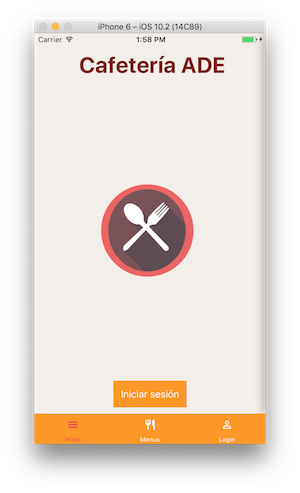
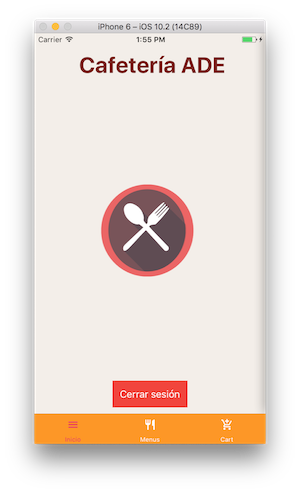
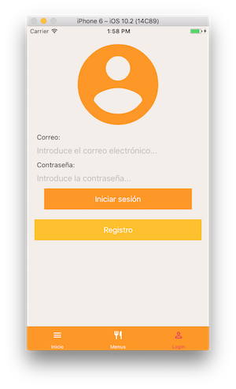
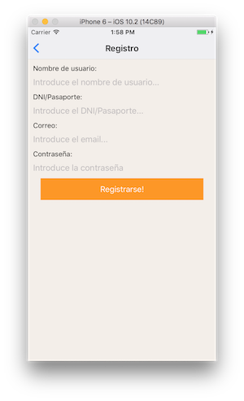
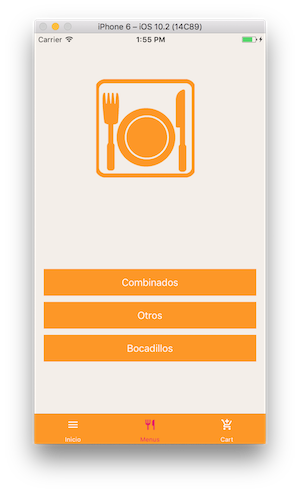
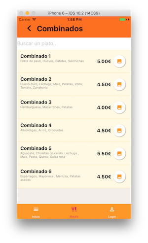
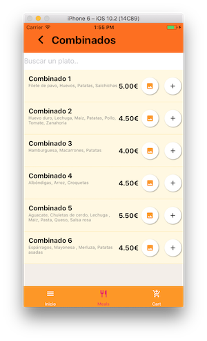
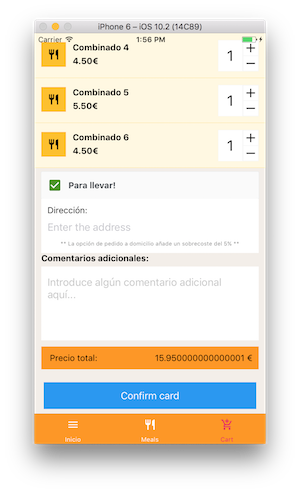
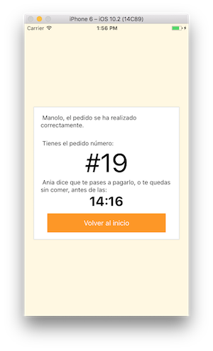
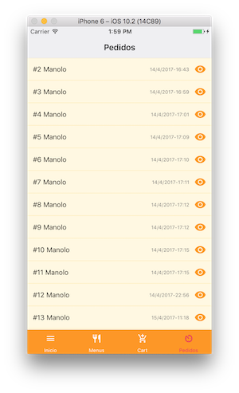

# Cafeteria ADE
---

Prototipo de aplicación para la gestión de la cafetería de la facultad de Administración y Dirección de Empresas de la EHU.

La aplicación está desarrollado utilizando React Native y Firebase.

## Prerequisitos

Para poder probar la aplicación se necesita tener instalado Node.JS además de un emulador para iOS o Android.
Se puede consultar la documentación oficial de React Native para la configuración.
Además, para trabajar en modo desarrollo, es recomendable trabajar utilizando Expo IDE.

* [NodeJS](https://nodejs.org/es/)
* Emulador Android/iOS
* [Expo IDE](https://expo.io/)

## Guia de uso
---
### Instalación

Primero instalar las dependencias globales.

```
$ npm install -g create-react-native-app
  # o
$ yarn global add create-react-native-app
```

```
$ npm install -g react-native-cli
  # o
$ yarn global add react-native-cli
```

A continuación instalar las dependencias del proyecto

```
$ npm install
```

### Probar aplicación

Para probar la aplicación se puede hacer utilizando [ExpoIDE](https://expo.io/), basta con tenerlo instalado y ejecutar el comando
`npm run start`
Después de ejecutar el comando, abrir la herramienta y seleccionar un emulador para Android o iOS.

Si no se tiene instalado ExpoIDE primero hay que ejecutar `npm eject` para poder tener la versión completa. Este es un cambio irreversible.
A continuación se debe lanzar el comando `react-native run-ios` o `react-native run-android` en función de la plataforma sobre la que queramos probarla.

### Capturas

| Funcionalidad | Actor | Captura |
| --------------------------------|
| **Inicio:** Vista de la pagina de inicio. | Anónimo, Usuario, Empleado | |
| **Iniciar sesión:** Vista de la página para iniciar la sesión. | Anónimo. |  |
| **Registro:** Página para registrar nuevos usuario | Anónimo |  |
| **Ver menús:** Pantalla para ver los diferentes tipos de menús y los platos en cada uno de ellos. | Anónimo, Usuario, Empleado |    |
| ** Añadir plato a la carta: ** Funcionalidad para añadir un plato a la lista de la compra. Solo disponoble para usuario con la sesión iniciada. | Usuario, Empleado |  |
| **Confirmar/Modificar pedido:** Página para poder confirmar el pedido, modificar, incrementar el número de platos, enviar a domicilio o añadir algún comentario extra | Usuario, Empleado |   |
| ** Confirmación pedido: ** Pestaña con los detalles del pedido una vez se ha confirmado. | Usuario, Empleado |  |
| **Lista de pedidos:** Lista con los pedidos de los usuarios. | Empleado | |
| **Detalles pedido:** Funcionalidad para ver y/o confirmar el pedido realizado por un usuario. | Empleado | 


### Licencia

Este proyecto está bajo la licencia MIT - ver el archivo [LICENSE.md](LICENSE.md).


### Built With

* [React Native](https://facebook.github.io/react-native/) - Framework utilizado para desarrollo aplicación hibrida.
* [Firebase](https://firebase.google.com/) - Base de datos.

### Authors

* **Joseba Carral**  - [JCarral](https://github.com/JCarral)
* **David Montllor** - [Montllor](https://github.com/montllor)
* **Ania Berazaluce** - [aniabera](https://github.com/aniabera)
